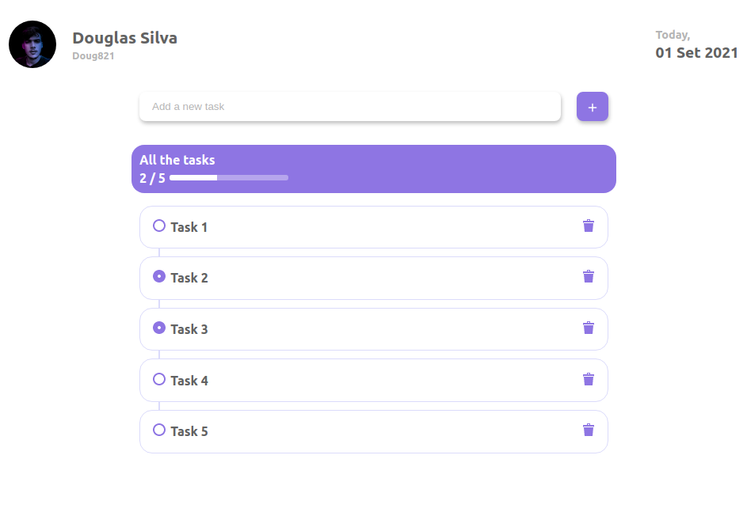

<div style="text-align: center;"></div>

# I Do Task App
### I Do is an app created using React Js and gets you a task manager, using local storage and github api to get username, name and profile picture.
#

## Running locally
### `Installing dependencies`
```  
npm install or yarn install.
```
### `Starting the project`
```
npm start or yarn start.
```

It runs the app in the development mode.
Open [http://localhost:3000](http://localhost:3000) to view it in the browser.
#
# Preview
## Sample preview of the app.


<div style="text-align: center;"></div>
<div style="text-align: center;"></div>

This project was bootstrapped with [Create React App](https://github.com/facebook/create-react-app).
